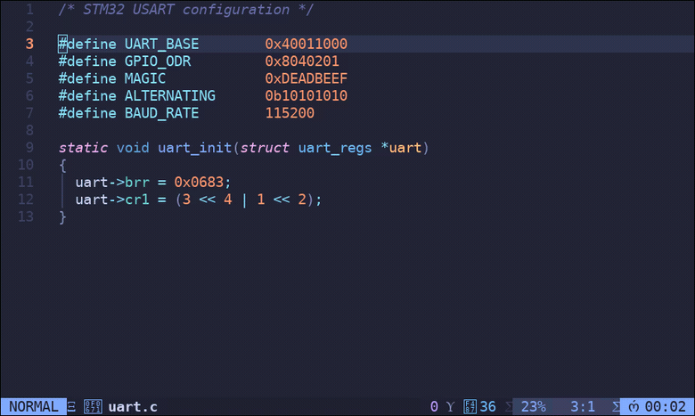

# vim-bitwise

Vim and Neovim integration for [Bitwise](https://github.com/mellowcandle/bitwise).

Evaluate an expression from your buffer and see its decimal, hexadecimal,
octal and binary representations without leaving the editor.

<p align="center">
  
</p>

<p align="center">
  <sub>The cursor walks down the literals and the hover follows; <code>&lt;C-w&gt;z</code> dismisses it;
  <code>gbi(</code> runs the operator over <code>(3 &lt;&lt; 4 | 1 &lt;&lt; 2)</code>.</sub>
</p>

## Features

* **Hover** — rest the cursor on a number in normal mode and its
  representations appear in a floating window beside it. No keystroke needed.
* `:Bitwise <expression>` — run _bitwise_ on an expression, or on the word
  under the cursor when called with no argument.
* `<Leader>b` operator — run _bitwise_ on any motion or text object.
* `<Leader>b` in visual mode — characterwise, linewise and blockwise
  selections all work.
* Results in a floating window on Neovim, or a reusable split on Vim.
* `:checkhealth bitwise` on Neovim.

## Hover

Put the cursor on a numeric literal and the values show up next to it; move off
and the window goes away.

```c
uint32_t mask = 0x8040201;
                ^ cursor here
```

Enabled by default on Neovim, where _bitwise_ runs asynchronously so nothing
blocks. On Vim it uses a popup window and runs synchronously, so it is opt-in:

```vim
let g:bitwise_hover = 1     " enable on Vim
let g:bitwise_hover = 0     " disable on Neovim
let g:bitwise_hover_delay = 250   " ms the cursor must sit still
```

`:BitwiseHoverToggle` flips it for the session, and `:BitwiseHover` shows one
immediately without waiting.

### Getting it out of the way

The hover is transient — move the cursor, enter insert mode, or open the
command line and it's gone. When it's covering something you want to read,
dismiss it in place:

```vim
nmap <C-w>z <Plug>(bitwise-hover-close)   " or :BitwiseHoverClose
```

The dismissal is sticky, so it won't spring back while you read; it lapses when
you move to a different number. To use `<Esc>` instead, set this **before** the
plugin loads:

```vim
let g:bitwise_hover_esc = 1
```

It's off by default because mapping `<Esc>` in normal mode makes the editor wait
`ttimeoutlen` on every escape sequence (arrow keys send one), and many configs
already use `<Esc>` for `:nohlsearch` — the plugin won't take the key if
something else has it.

Hex (`0x1F`), binary (`0b1010`), octal (`0o17`) and decimal literals are
recognised, including digit separators and size suffixes — `0xFF_u8` and
`1_000` both work. Identifiers that just happen to contain digits (`foo123`)
and the halves of a float (`1.5`) are ignored on purpose. Results are cached,
so revisiting a number is free.

## Usage examples

| Keys | Runs _bitwise_ on |
| --- | --- |
| `<Leader>biw` | the word under the cursor |
| `<Leader>biW` | the WORD under the cursor |
| `<Leader>bi(` | the text inside the next `()` |
| `<Leader>b$` | to the end of the line |
| `v3e<Leader>b` | the visual selection |
| `:Bitwise 1 << 4 \| 3` | the given expression |
| `:BitwiseHover` | the number under the cursor, in a hover |

Press `q` to close the result window (`<Esc>` also works for the Neovim float).

## Try it without installing

First make sure _bitwise_ itself is present — the plugin is a front end for it
and does nothing without it:

```sh
sudo apt install bitwise      # Debian/Ubuntu
bitwise --version             # should print a version
```

If you have a _bitwise_ checkout instead of an installed package, `test/vimrc`
finds it automatically when it sits next to this repo (`../bitwise/bitwise`),
or wherever `$BITWISE` points:

```sh
BITWISE=~/dev/bitwise/bitwise nvim -u test/vimrc examples/registers.c
```

`examples/registers.c` exercises every literal form the plugin understands.
Open it with the repo on the runtimepath and nothing else in the way:

```sh
nvim -u test/vimrc examples/registers.c   # or: vim -u test/vimrc ...
```

Put the cursor on any number and wait a moment. (On Vim, add
`:let g:bitwise_hover = 1` first.)

If nothing appears, run `:checkhealth bitwise` on Neovim — the most likely
cause is that the binary is not on `$PATH`, which the hover reports once and
then stays quiet about.

## Installation

Make sure _bitwise_ is installed and available in your `$PATH` (`sudo apt
install bitwise` on Debian/Ubuntu, or build it from
[source](https://github.com/mellowcandle/bitwise)), then install this plugin
with your plugin manager of choice:

```vim
" vim-plug
Plug 'mellowcandle/vim-bitwise'

" Vundle
Plugin 'mellowcandle/vim-bitwise'
```

To install manually, clone the repository into `~/.vim/pack/plugins/start/`
(Vim 8+) or `~/.local/share/nvim/site/pack/plugins/start/` (Neovim).

### Neovim with lazy.nvim

Drop this in `~/.config/nvim/lua/plugins/bitwise.lua`:

```lua
return {
  {
    "mellowcandle/vim-bitwise",

    -- Not lazy-loaded on a key or command: the automatic hover lives in an
    -- autocmd, so the plugin has to be resident for it to fire at all.
    lazy = false,

    init = function()
      -- Only if bitwise is not on your $PATH:
      -- vim.g.bitwise_executable = vim.fn.expand("~/dev/bitwise/bitwise")

      -- Set before the plugin loads. Skip if <Leader>b is free for you.
      vim.g.bitwise_no_mappings = 1
    end,

    keys = {
      { "gb", "<Plug>(bitwise-operator)", mode = { "n", "x" }, desc = "Bitwise on motion/selection" },
      { "gB", "<Plug>(bitwise-hover)", desc = "Bitwise hover (now)" },
      { "<C-w>z", "<Plug>(bitwise-hover-close)", desc = "Dismiss bitwise hover" },
      { "<leader>ub", "<cmd>BitwiseHoverToggle<cr>", desc = "Toggle bitwise hover" },
    },
  },
}
```

Two things worth knowing:

* **Don't lazy-load it on `keys` or `cmd`.** The hover is driven by an
  autocmd, so the plugin must already be resident when you move the cursor.
  `keys`/`cmd` alone would mean the hover only starts working after you first
  press one of those keys. It is one small vimscript file, so `lazy = false`
  costs nothing.
* **Check `<Leader>b` first.** On LazyVim that is the buffer prefix
  (`<leader>be`, `bt`, `bs`, `bv`, ...), and the plugin's default operator
  mapping would make motions like `e`, `l` and `t` ambiguous. Hence
  `bitwise_no_mappings` plus the `gb` bindings above. Run
  `:nmap <Leader>b` to see what you already have.

To develop against a local checkout, swap the repo name for its path:

```lua
dir = vim.fn.expand("~/dev/vim-bitwise"),
```

## Configuration

| Setting | Default | Meaning |
| --- | --- | --- |
| `g:bitwise_executable` | `'bitwise'` | Path to the _bitwise_ binary, e.g. `~/dev/bitwise/bitwise` |
| `g:bitwise_flags` | `['--no-color']` | Arguments passed before the expression |
| `g:bitwise_output` | `'float'` on Neovim, `'split'` on Vim | `'float'`, `'split'` or `'echo'` |
| `g:bitwise_height` | `0` (fit to output) | Height of the split |
| `g:bitwise_border` | `'rounded'` | Border of the Neovim float |
| `g:bitwise_hover` | `1` on Neovim, `0` on Vim | Automatic hover on the number under the cursor |
| `g:bitwise_hover_delay` | `250` | Milliseconds the cursor must sit still |
| `g:bitwise_hover_esc` | `0` | Set to `1` to dismiss the hover with `<Esc>` |
| `g:bitwise_no_mappings` | `0` | Set to `1` to skip the default mappings |

To use your own keys:

```vim
let g:bitwise_no_mappings = 1
nmap <Leader>n <Plug>(bitwise-operator)
xmap <Leader>n <Plug>(bitwise-operator)
nmap <Leader>nl <Plug>(bitwise-line)
nmap <Leader>nw <Plug>(bitwise-cword)
nmap <Leader>nh <Plug>(bitwise-hover)
```

See `:help vim-bitwise` for the full documentation.

## Development

```sh
./test/run.sh
```

The suite runs against both `vim` and `nvim` (whichever are installed) using a
stub _bitwise_ binary, so it needs no external dependencies. It also runs
`test/integration.sh`, which drives a real headless Neovim over RPC to exercise
the hover — `CursorMoved` does not fire for a script run with `-S`, so the hover
cannot be tested in-process.

## Contribution

Contributions are most welcome. Please run `./test/run.sh` before opening a
pull request.
